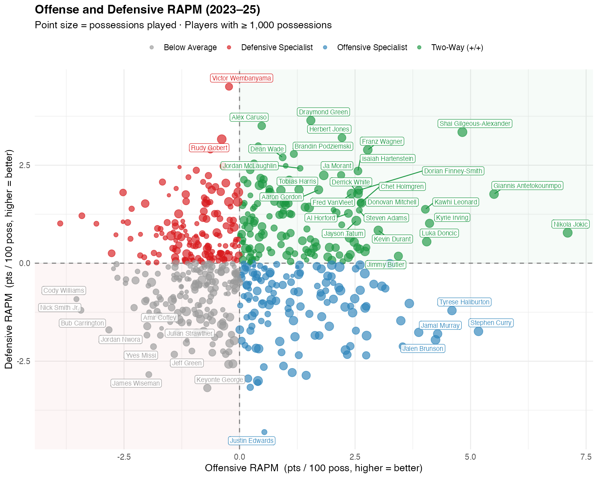
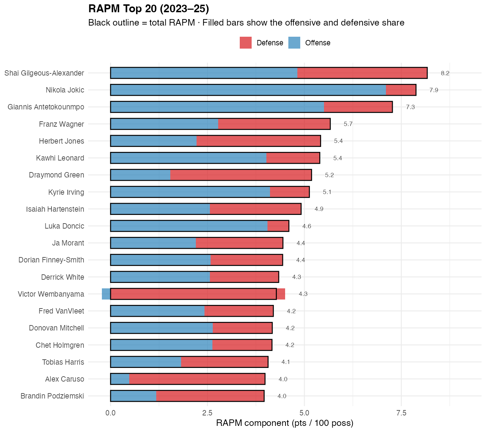
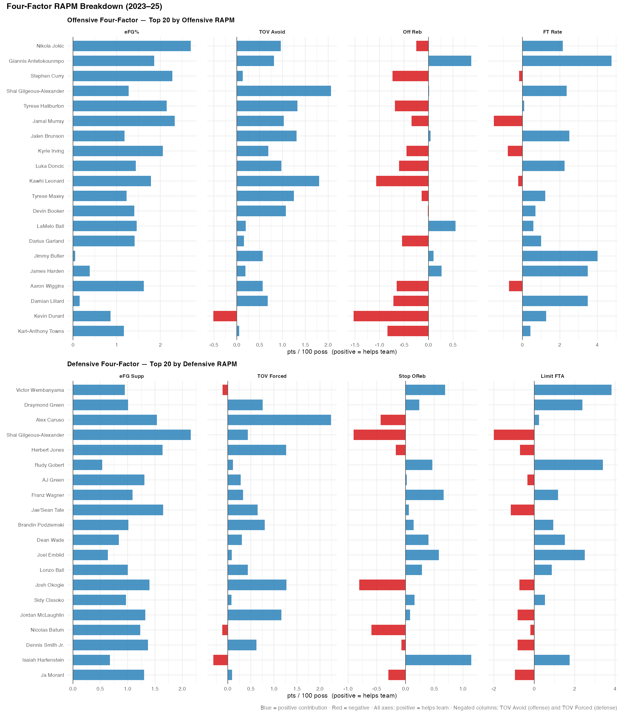
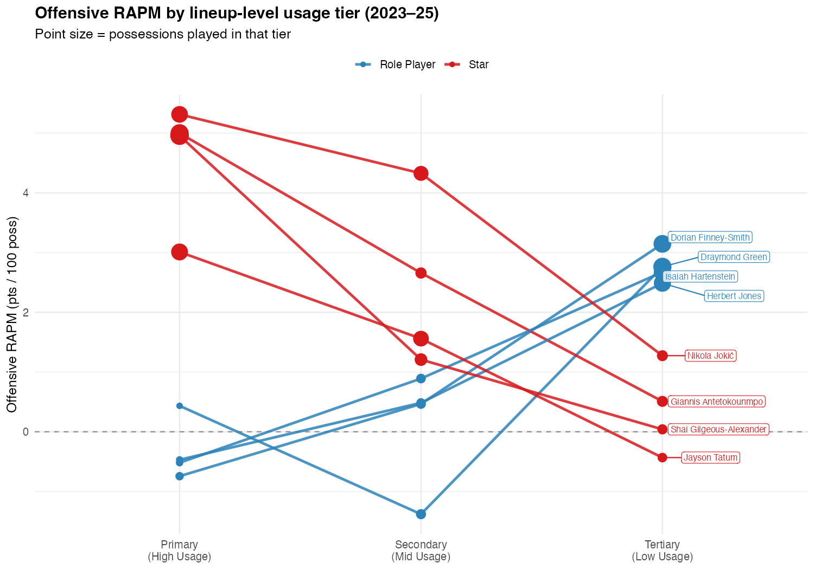

# NBA RAPM Models

Regularized Adjusted Plus-Minus (RAPM) models built from NBA play-by-play data spanning the 2023–2025 seasons. Files include code for vanilla 3 year APM/RAPM, 4 Factor RAPM (offense and defense, so more like 8 Factor), and a usage based RAPM. All models use 50/30/20 weighting (with 50% being for the 2025 season, 30% for 2024, 20% for 2023). 

## Analysis

Using the outputs of the various models, we can do some basic data viz and analysis. 

First, we have offensive and defensive RAPM plotted against each other, with players colored by quadrant. True two-way players (upper-right) are fairly rare — the majority of the league specializes in one dimension or sits below average in both. Point size scales with possessions played.

---

Next, we take a look at the top 20 players by total RAPM, with stacked bars showing the offensive and defensive split. The black outline marks each player's total, making it easy to spot cases like Wembanyama where elite defensive value is partially offset by a negative offensive contribution.

---

Here we can see a two-panel breakdown of the four factors for the top 20 offensive and top 20 defensive players per RAPM. eFG% is unsurprisingly the strongest and most consistent component for contributing to an ORAPM or DRAPM rating, but we can see examples like Tyrese Haliburton and Jamal Murray where their metrics look pretty similar until we get to FT Rate, in which we see Haliburton actually has a much stronger FT differential rating than Murray, contributing to his edge in ORAPM. 

Likewise, in DRAPM while Alex Caruso impacts opponent turnovers much more strongly than Draymond Green, Green shows stronger impact at reducing opponent offensive rebounds and FT rate.

---

Finally using the results of our usage tier RAPM model, we can begin to see how a players offensive role effects their overall ORAPM rating. 

For example, Dorian Finney-Smith ranks 34th overall in ORAPM, while Jayson Tatum ranks 38th. However, if you look at their usage based ORAPM, we see that Tatum as a first option and Finney-Smith as a third+ option have very similar effects, but that Finney-Smith's impact declines as his usage tier increases, while Tatum's declines as his usage tier decreases.

## Data
Data is sourced from Ramiro Bentes GitHub repo for NBA play-by-play data.

**Source:** [`ramirobentes/nba_pbp_data`](https://github.com/ramirobentes/nba_pbp_data)

## Files

### `APM_RAPM.R`
Baseline two-way APM and RAPM using points per possession as the response.

Fits two models:
- **O/D APM** — weighted least squares
- **RAPM** — ridge regression (L2), lambda selected by 10-fold CV

| Column | Description |
|--------|-------------|
| `orapm` | Offensive RAPM (pts added per 100 poss on offense) |
| `drapm` | Defensive RAPM (pts suppressed per 100 poss on defense) |
| `rapm`  | Two-way RAPM (`orapm + drapm`) |
| `poss`  | Total possessions on court |

---

### `4factor_RAPM.R`
Fits a separate ridge regression for each of Dean Oliver's four factors using the same design matrix as the baseline model.

| Column | Description |
|--------|-------------|
| `oefg_rapm` | Offensive eFG contribution per 100 poss |
| `defg_rapm` | Defensive eFG suppression per 100 poss |
| `otov_rapm` | Turnovers caused per 100 poss on offense *(lower = better)* |
| `dtov_rapm` | Turnovers forced per 100 poss on defense |
| `oorb_rapm` | Offensive rebounds grabbed per 100 poss |
| `dorb_rapm` | Offensive rebounds surrendered per 100 poss *(lower = better)* |
| `oftr_rapm` | FTA drawn per 100 poss on offense |
| `dftr_rapm` | FTA allowed per 100 poss on defense *(lower = better)* |

---

### `usage_RAPM.R`
Extends the baseline model by splitting each player's offensive contribution into three role tiers based on their **lineup-specific usage rate** (FGA + 0.44·FTA + TOV). Within each possession, the 5 offensive players are ranked by their usage rate in that exact 5-man lineup context.

| Tier | Definition |
|------|------------|
| o1   | Highest-usage player on the floor (primary option) |
| o2   | Second-highest usage player (secondary option) |
| o3   | All remaining offensive players (complementary role) |

This answers questions like *"Is Tatum more valuable as a first or second option?"* by estimating separate RAPM coefficients for each role. Tiers are assigned by lineup-specific (not season-average) usage, so a player's tier varies across lineup contexts.

| Column | Description |
|--------|-------------|
| `orapm`   | Overall offensive RAPM (role-agnostic, from standard 2-way model) |
| `drapm`   | Overall defensive RAPM (role-agnostic) |
| `rapm`    | Two-way RAPM (`orapm + drapm`) |
| `o1_rapm` | Pts added per 100 poss as the primary option |
| `o2_rapm` | Pts added per 100 poss as the secondary option |
| `o3_rapm` | Pts added per 100 poss as a complementary piece |
| `d_rapm`  | Defensive RAPM from the usage-tier model |
| `poss`    | Total possessions on court |
| `o1_poss` | Possessions as primary option |
| `o2_poss` | Possessions as secondary option |
| `o3_poss` | Possessions as complementary piece |

## Methodology Notes

- All models use **ridge regression** (`glmnet`, `alpha = 0`) with lambda chosen by 10-fold cross-validation.
- Design matrix entries are `+1` for offensive players and `−1` for defensive players. Higher offensive coefficients = better offense; higher defensive coefficients = better defense.
- Player names are normalized using a **player ID → canonical name** lookup built from the lineup data, resolving cross-season spelling inconsistencies automatically.
- All coefficients are scaled to **per 100 possessions**.
